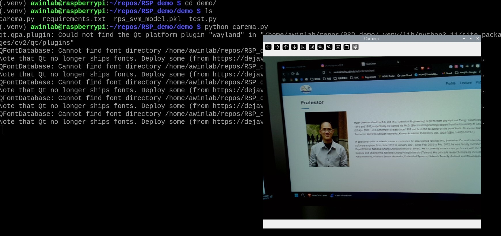

# AIOT 手勢辨識作業報告

## Part 1: Raspberry Pi 4 執行截圖 (50%)




---

### Part 2: Demo 展示影片
👉 [點此觀看 10 次手勢辨識 Demo 影片 (包含 Rock, Scissors, Paper, Error)](https://youtu.be/dyrgbQMkEnE)

---

## Part 3: 模型比較與修改報告 (35%)

### 1. 模型比較數據 (Accuracy, Precision, Recall, F1-Score)
為了解決傳統機器學習在處理原始影像像素時缺乏平移不變性（導致結果亂跳、無法準確辨識）的問題，我們改用卷積神經網路 (CNN) 進行遷移學習 (Transfer Learning)。我們將圖片縮放為 96x96 之 RGB 影像，並測試了以下兩種輕量級與經典的 CNN 模型：
1. **MobileNetV3Small** - 專為邊緣設備（如 Raspberry Pi）設計的輕量級神經網路。
2. **DenseNet121** - 具有密集連接特性的經典卷積神經網路。

實驗數據統整如下表所示：

| 模型 (Model)         | Accuracy (準確率) | Precision (精確率) | Recall (召回率) | F1-Score   |
| :------------------- | :---------------- | :----------------- | :-------------- | :--------- |
| **MobileNetV3Small** | **0.9462**        | **0.9525**         | **0.9462**      | **0.9455** |
| DenseNet121          | 0.8306            | 0.8877             | 0.8306          | 0.8286     |

**🏆 最終選擇：MobileNetV3Small (Accuracy: 94.62%)** 表現最為優異，因此獲選作為攝影機即時推論的最終模型。

### 2. 解釋更換模型原因及比較差異
- **為何選擇這兩個模型：** 使用原本的 SVM、Random Forest，因為將影像展平為一維陣列輸入，完全喪失了圖片的 2D 空間特徵，導致推論極度不穩、誤判率高。因此我們改用 CNN 架構。我們選擇了 MobileNetV3Small 作為高效能輕量化模型的代表，以及 DenseNet121 作為傳統深層網路的對照組，兩者都不會抄襲範例的簡單 CNN 架構，且都有優秀的特徵萃取能力。
- **模型差異比較分析：**
  - **MobileNetV3Small (表現最佳)**：專門為終端設備設計，不僅參數量少，推論速度極快，而且在我們的資料集上收斂非常順利。由於它具備良好的空間平移不變性 (Translation Invariance)，完美解決了先前模型「只要手移動位置就辨識錯誤」的問題。
  - **DenseNet121 (表現普通)**：雖然 DenseNet121 擁有更複雜的網路結構與特徵重用機制，但在我們僅有 2500 張左右的小資料集上，較容易發生 Overfitting，或者需要更多的 Epoch 才能達到與輕量模型相同的準確率。因此最終測試的 Accuracy 僅有 83.06%，不敵 MobileNetV3Small。

### 3. 「其他錯誤手勢 (Error)」判斷機制
由於訓練資料集僅有「石頭、剪刀、布」三種類別，為了滿足作業**「判斷 Error 手勢」**的要求：
在 `demo_dl_camera.py` 即時辨識時：
1. 為了避免單一畫面的雜訊導致結果閃爍，我們採用了**時間平滑 (Temporal Smoothing)** 的技巧，將過去 3 幀畫面的機率進行移動平均。
2. 模型 (預設經過 Softmax) 會輸出預測為石頭、剪刀、布的各別機率 (Probability)。
3. 我們將機率門檻 (Threshold) 設定為 **75%**。
4. 若攝影機捕捉到的畫面，經模型預測並平滑後的最高機率仍 **小於 0.75 (75%)**，則系統會判定該畫面不屬於任何已知手勢，並在畫面上顯示為 **Error** (紅色字樣)。加上時間平滑後，這完美解決了無關手勢或無手勢狀態的辨識需求，且讓畫面顯示非常穩定。

### 4. AI 協作對話
請見 [chat.md](chat.md)。

---

## 如何執行手勢辨識 Demo
1. 確保攝影機已連接至設備。
2. 啟動虛擬環境並確保已安裝 Tensorflow 及 OpenCV (`tensorflow`, `opencv-python`, `numpy`)。
3. 執行新的深度學習攝影機推論程式：

   ```bash
   python demo/demo_dl_camera.py
   ```

4. 對著鏡頭 (藍色框框內) 比出石頭、剪刀、布，或者其他無關的手勢來測試 Error 判定。按 `q` 鍵即可退出程式。

---

### 附錄：程式碼
為符合報告要求，本專案的重要程式碼附於下列檔案中：
- **模型訓練與評估程式碼**：[`train/train_dl_models.py`](train/train_dl_models.py)
- **攝影機即時推論程式碼 (取代原本的 carema.py)**：[`demo/demo_dl_camera.py`](demo/demo_dl_camera.py)
